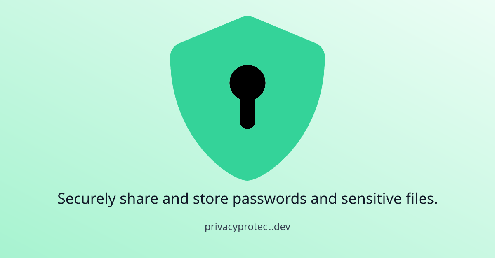

<h1 align="center">PrivacyProtect</h1>
<p align="center">
  End-to-end encryption without special software or accounts; only native web browser crypto APIs.
</p>
<h4 align="center">
  <a href="https://www.privacyprotect.dev/">Website</a> | <a href="https://www.privacyprotect.dev/blog/introducing-privacyprotect?utm_source=github&utm_medium=social&utm_campaign=blog&utm_content=readme">Launch Blog</a>
</h4>

<h4 align="center">
   <a href="https://github.com/emazzotta/lighthouse-badges">
    
  </a>
   <a href="https://github.com/emazzotta/lighthouse-badges">
    
  </a>
   <a href="https://github.com/emazzotta/lighthouse-badges">
    
  </a>
   <a href="https://github.com/emazzotta/lighthouse-badges">
    
  </a>
   <a href="https://securityheaders.com/?q=https%3A%2F%2Fwww.privacyprotect.dev%2F&hide=on&followRedirects=on">
    
  </a>
   <a href="https://www.ssllabs.com/ssltest/analyze.html?d=privacyprotect.dev">
    
  </a>
   <a href="https://ahrefs.com/site-audit">
    
  </a>
</h4>

[](https://www.privacyprotect.dev/)

Share passwords and sensitive files over email or store them in insecure locations like cloud drives using nothing more than desktop or mobile web browsers like Chrome and Safari.

No special software. No need to create an account. It’s free, open-source, keeps your private data a secret, and leaves you alone.

## Table of Contents

- [Security](#security)
- [Usage](#usage)
- [CLI](#cli)
- [Acknowledgements](#acknowledgements)
- [Contributing](#contributing)
- [License](#lincense)

## Security

See [SECURITY.md](./SECURITY.md) and [privacyprotect.dev/security](https://www.privacyprotect.dev/security).

## Usage

This project uses:

- [prettier](https://prettier.io/) code formatting
- [commitlint](https://github.com/conventional-changelog/commitlint) commit message formatting
- [ESLint](https://eslint.org/) rules

### Common commands

```bash
# Install dependencies
npm install

# Run development server
npm run dev -- --open

# While editing template.html or template.ts, run watch mode to generate
# template.js and template.css
npm run watch:template
```

## CLI

### Encrypt

```bash
Usage: ./cli encrypt [OPTIONS] [--file OR --message] [OUT]

Encrypt a file or message, creating a PrivacyProtect HTML file.

Options:
  --help, -h        Print usage.

  --file, -f        Path to secret file to conceal.
  --hint            Password hint.
  --message, -m     Secret message to conceal.
  --password, -p    Password used to conceal your secret. Provided as a
                    convenience to allow for scripting. If not provided as an
                    option, the CLI will prompt for it and hide typed characters.
  --deniableMessage Secret message to conceal. If provided, the CLI will prompt
                    for a second password. Entering this password while under
                    duress will reveal the deniableMessage instead of the
                    --message or --file.

Examples:
  ./cli.ts encrypt -m "My secret" --hint "My hint" ./out/secret.html
```

### Decrypt

```bash
Usage: ./cli decrypt [OPTIONS] [FILE]

Decrypt a PrivacyProtect HTML file.

Options:
  --help, -h        Print usage.
  --file, -f        Path to PrivacyProtect HTML file containing secret to reveal.
  --password, -p    Password used to reveal your secret. Provided as a
                    convenience to allow for scripting. If not provided as an
                    option, the CLI will prompt for it and hide typed characters.

Examples:
  ./cli.ts decrypt ./out/secret.html
```

## Acknowledgements

[`portable-secrets`](https://mprimi.github.io/portable-secret/)

## Contributing

See [CONTRIBUTING.md](./CONTRIBUTING.md). If editing README, conform to [standard-readme](https://github.com/RichardLitt/standard-readme).

## License

[MIT](./LICENSE)
